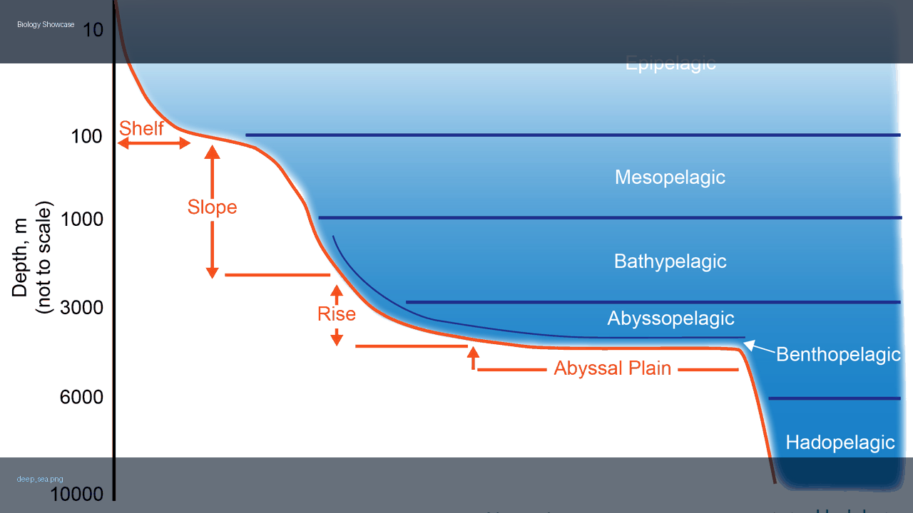
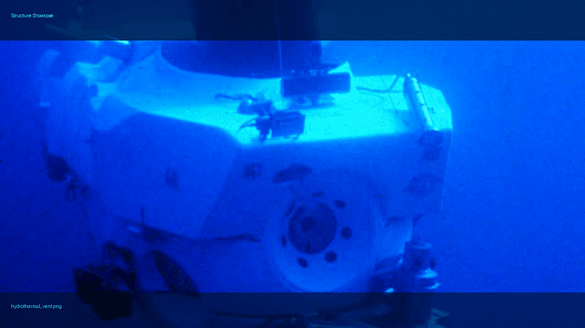
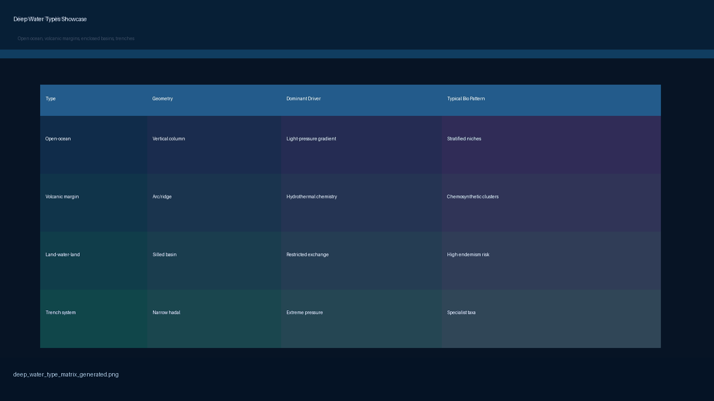
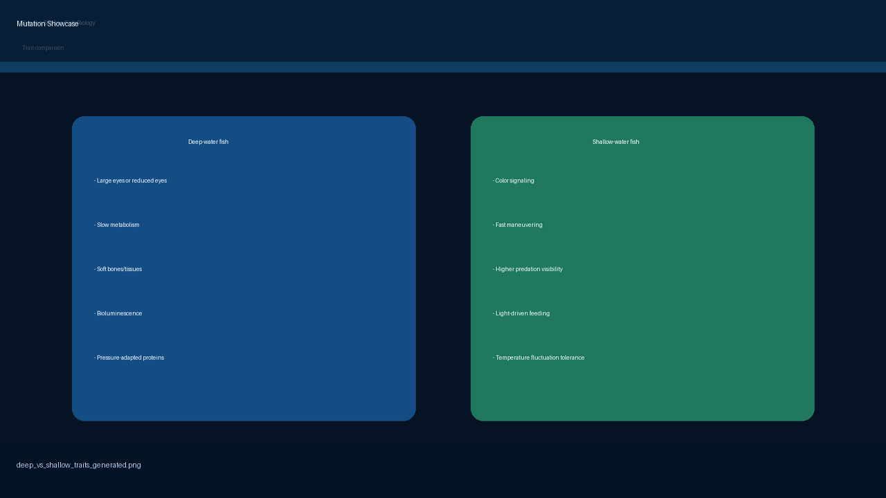

# Under Water Deep Research

Research node for deep-ocean studies, organized for parallel work across biology, structure, physics/chemistry, deep-water types, and mutation/adaptation.

Status date: April 19, 2026.

## Folder Map

- `biology/`
  - Animal adaptations, deep-vs-shallow fish comparison, ongoing biodiversity studies.
- `structure/`
  - Natural and artificial deep-water structures.
- `physics/`
  - Pressure, light, temperature, circulation, and chemistry.
- `deep-water-types/`
  - Classification of deep-water geographies (including volcanic margins and land-water-land basins).
- `mutation/`
  - Evolutionary and mutation-driven adaptation pathways in deep water.

## Interactive Labs

- `mutation/live-evolution-lab.html`
- `mutation/evolution-timeline-tree-lab.html`

## GIF Showcase

- 
- 
- 
- 
- 
- 

## Image Assets

Each study folder includes a `png/` subfolder with local PNG assets and its own `README.md`.

Image source notes:
- `IMAGE-SOURCES.md`

## Latest Tracker

- `LATEST-ONGOING-RESEARCH-TRACKER.md`

## Working Rule

Each track should maintain:
1. Core concepts
2. Active research questions
3. Latest ongoing studies with dates
4. Linked evidence and visual assets
