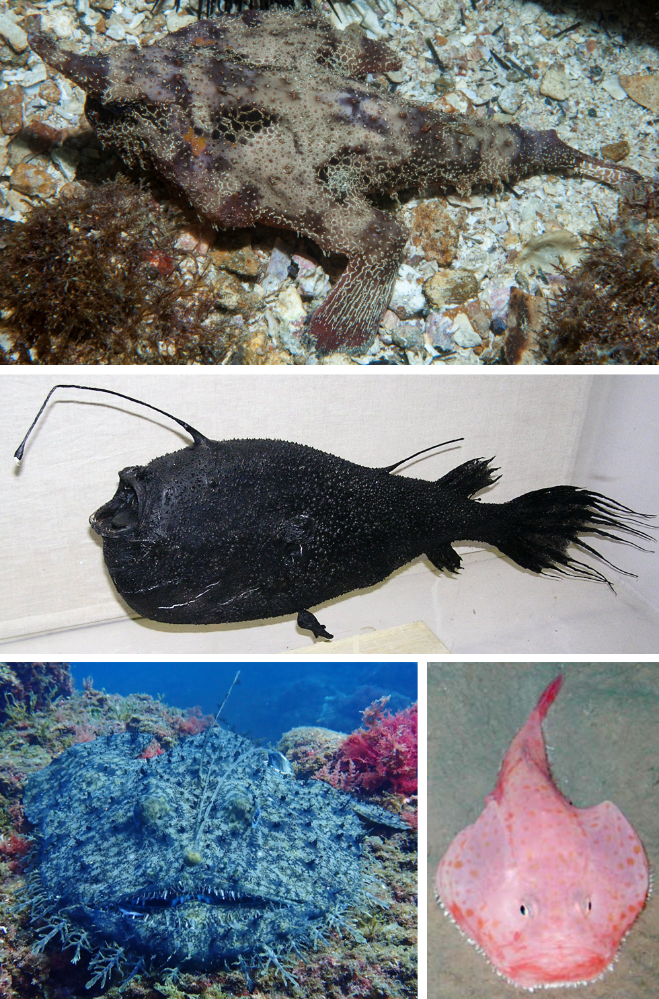
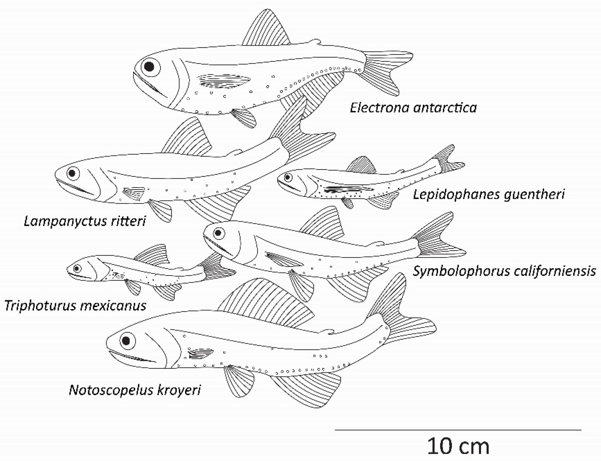
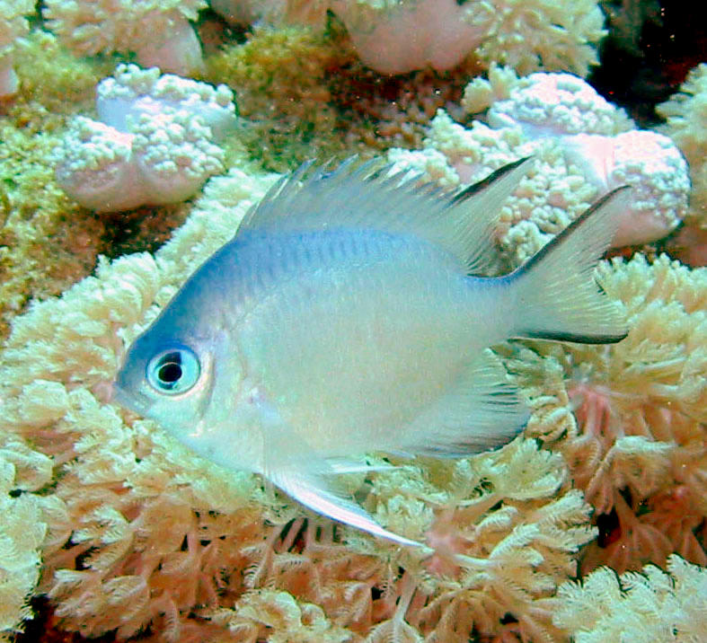

# Biology

This section tracks deep-sea animal biology and compares it with shallow-water fish systems.

## Key Living-Condition Patterns

- Pressure tolerance:
  - Deep fish evolve pressure-stable proteins, membrane chemistry shifts, and reduced gas-space dependence.
  - Shallow fish are optimized for lower hydrostatic pressure and larger vertical pressure variation near coasts.
- Energy economy:
  - Deep systems are food-limited, so many species show slower growth and lower routine metabolism.
  - Shallow systems usually have higher primary productivity and faster trophic turnover.
- Sensory strategy:
  - Deep fish commonly rely on bioluminescence, mechanosensation, and low-light vision.
  - Shallow fish rely more on color vision and daytime visual signaling.
- Morphology:
  - Deep fish trends include soft tissues, reduced ossification, wide-gape feeding, and specialized buoyancy strategies.
  - Shallow fish trends include stronger burst-swim morphology and reef/vegetation maneuverability.

## Deep vs Shallow Fish (working comparison)

- Deep-water fish:
  - Lower encounter rates with prey
  - Opportunistic feeding
  - Delayed maturity and conservative life history
- Shallow-water fish:
  - Higher predator-prey interaction frequency
  - More niche partitioning by reef/light/habitat complexity
  - Faster recruitment cycles in many groups

## Gallery

## Related Notes

- `deep-sea-animal-biology.md`
- `ongoing-studies-2025-2026.md`
- `fish-type-comparative-research.md`
