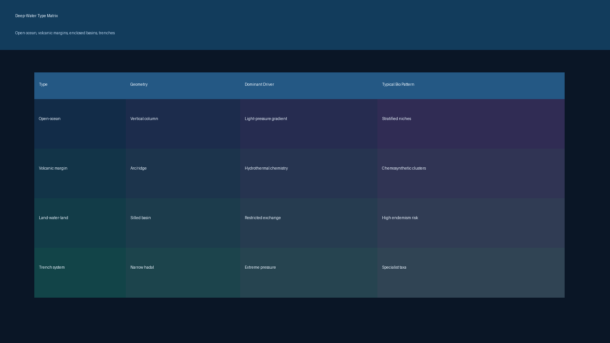
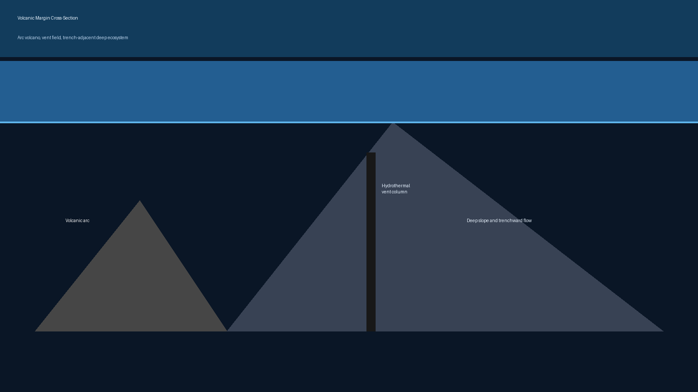
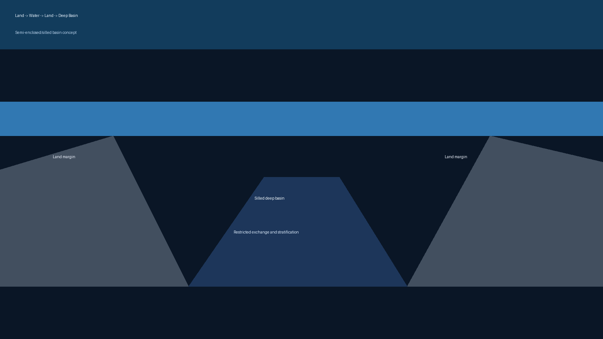

# Deep-Water Types

Classification layer for different deep-water contexts.

## Included Types

- Open-ocean depth stratification
- Volcanic-margin deep systems
- Land-water-land semi-enclosed basins with deep interior water
- Trench and chemically extreme deep settings

## Gallery

## Related Notes

- `deep-water-types-and-geographies.md`
