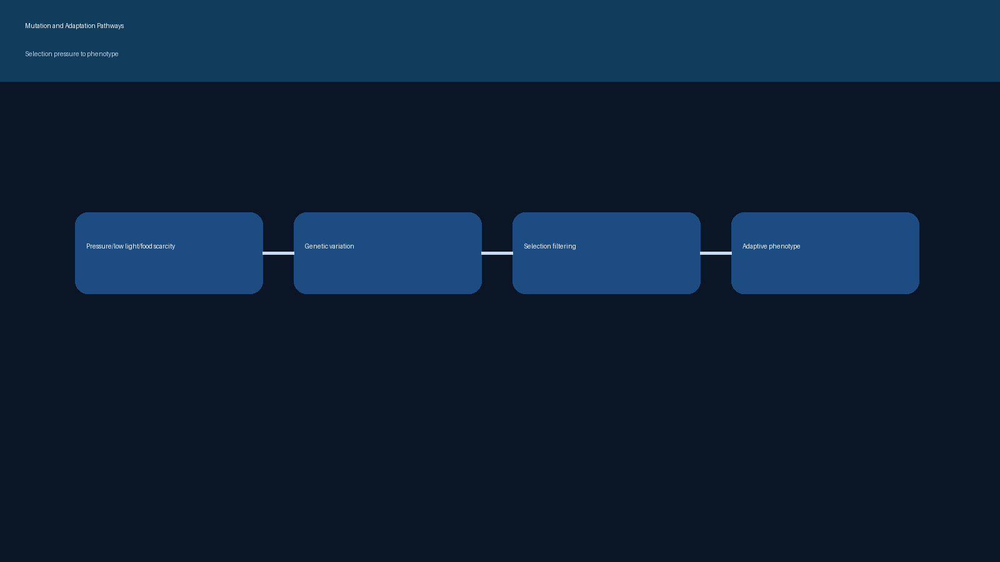
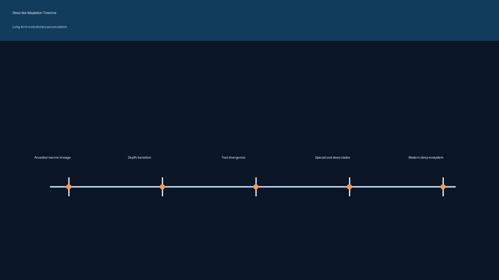

# Mutation and Adaptation

This folder focuses on evolutionary change under deep-water constraints.

## Why Mutation Matters in Deep Water

Deep habitats impose strong filters:
- Extreme pressure
- Persistent darkness
- Low and patchy food availability
- Chemical extremes near vents/seeps

Mutations that improve pressure tolerance, energy efficiency, sensory performance, and reproductive success under these constraints are more likely to persist.

## Deep vs Shallow Fish: Evolutionary Contrast

- Deep-water lineages often show:
  - Slower life history and lower metabolic intensity
  - Enhanced mechanosensory/bioluminescent functions
  - Molecular changes linked to protein stability and membrane behavior under pressure
- Shallow-water lineages often show:
  - Strong visual signaling and color-driven mate choice
  - Faster ecological turnover in higher-productivity systems
  - Greater adaptation to light and temperature variability

## Mutation-to-Phenotype Pathways (working)

- Point mutation and regulatory mutation:
  - Can alter opsin expression, metabolism, stress response, or sensory proteins.
- Gene duplication and divergence:
  - Expands functional space for pressure/light adaptation.
- Selection and drift in isolated deep habitats:
  - Can accelerate divergence and endemism.

## Interactive Visualization

- Open `live-evolution-lab.html` in a browser for DNA animation + live fish mutation/evolution transition.

## Gallery

## Related References

- Deep-sea gigantism: https://en.wikipedia.org/wiki/Deep-sea_gigantism
- Bioluminescence: https://en.wikipedia.org/wiki/Bioluminescence
- Astyanax mexicanus (model for sensory evolution): https://en.wikipedia.org/wiki/Astyanax_mexicanus
