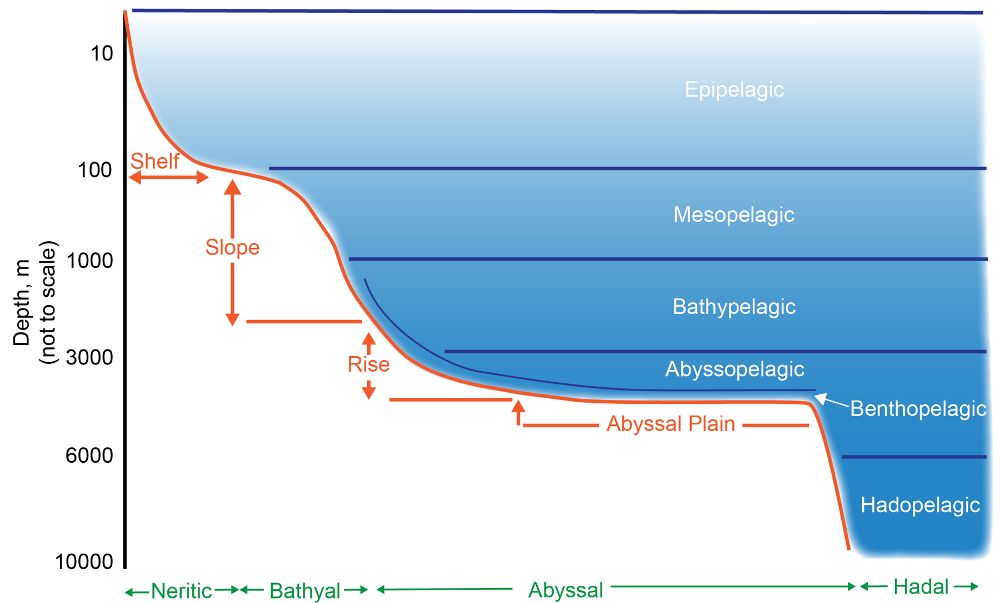
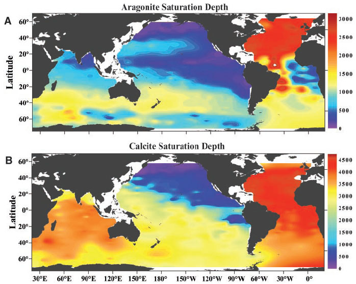
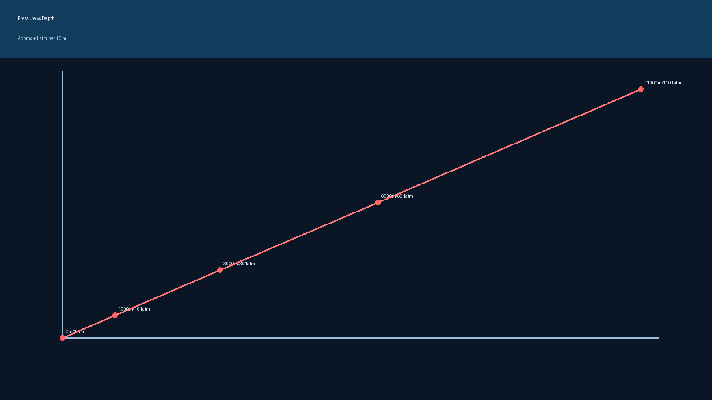
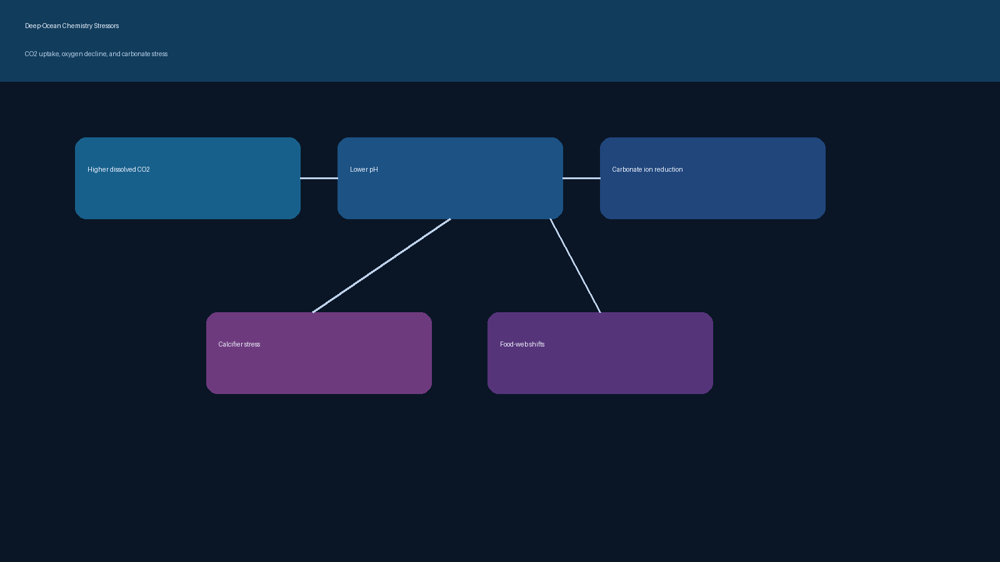

# Physics and Chemistry

Core physical and chemical constraints across depth.

## Pattern Summary

- Pressure rises approximately 1 atmosphere per 10 m depth.
- Light declines sharply below ~200 m, shifting ecosystems away from photosynthesis-driven food webs.
- Temperature, oxygen, and carbonate chemistry gradients shape survivability and community assembly.

## Gallery

## Related Notes

- `deep-ocean-physics-chemistry.md`
