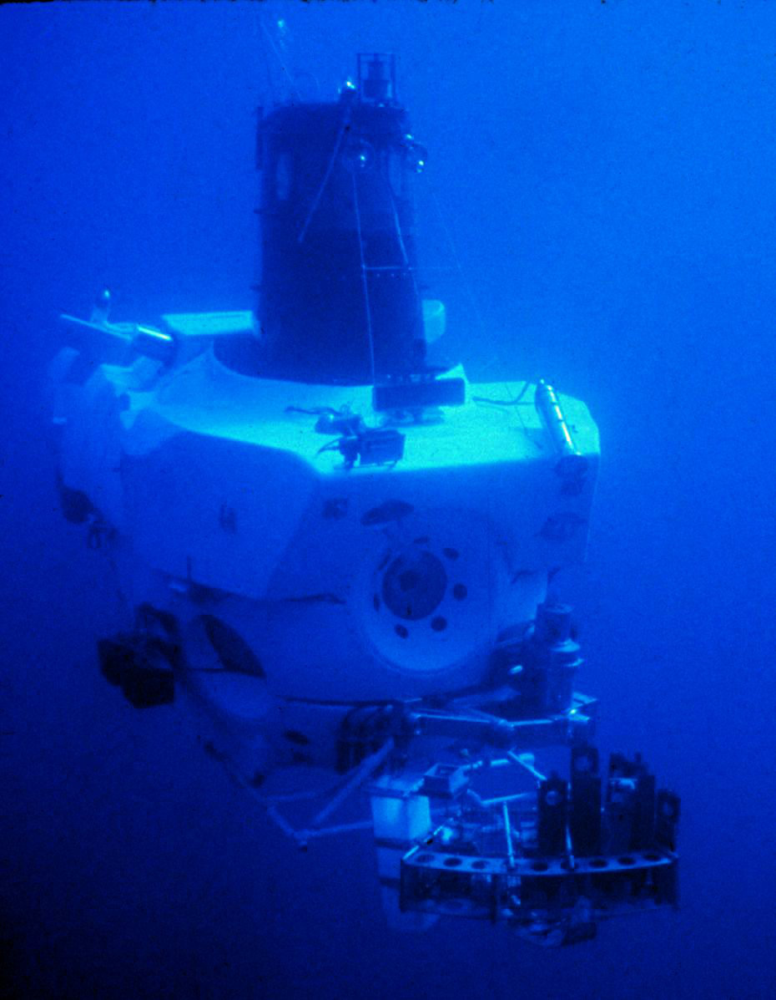
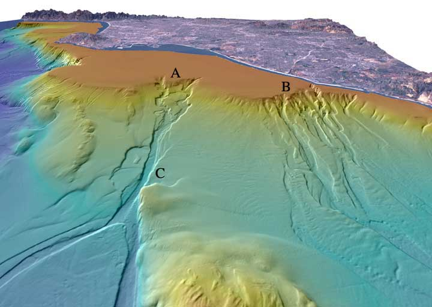
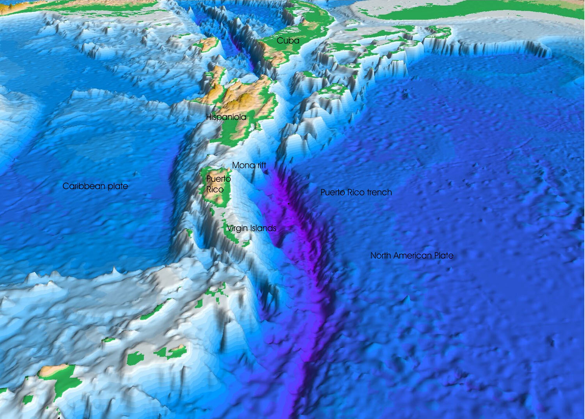
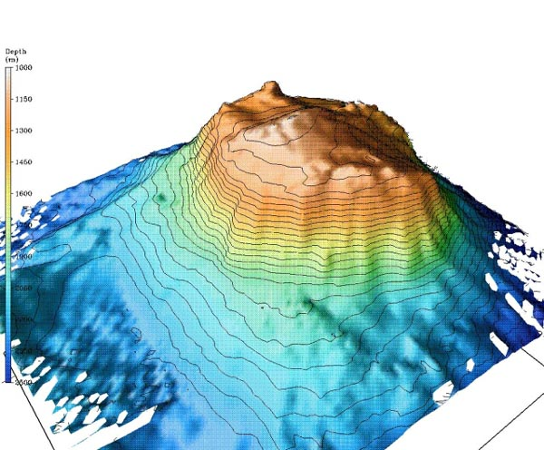

# Structure

Natural and artificial deep-water structure study node.

## Structural Pattern Summary

- Relief intensity controls biodiversity patching:
  - Trenches, canyon walls, and vent chimneys create strong microhabitat gradients.
- Flow-topography coupling:
  - Canyons and seamounts redirect currents, sediment, and particulate organic matter.
- Geology-biology coupling:
  - Volcanic and hydrothermal structures support chemically powered ecosystems.

## Gallery

## Related Notes

- `natural-structures.md`
- `artificial-structures.md`
